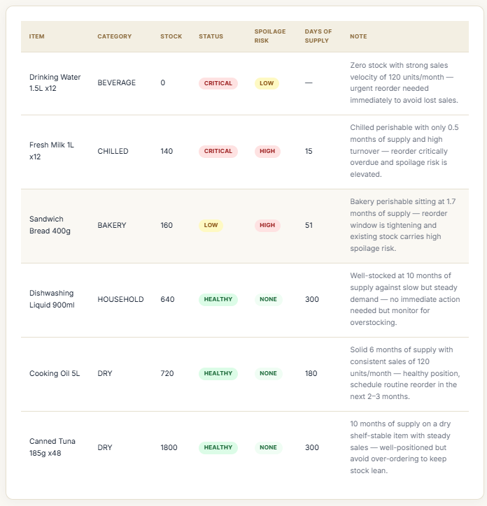
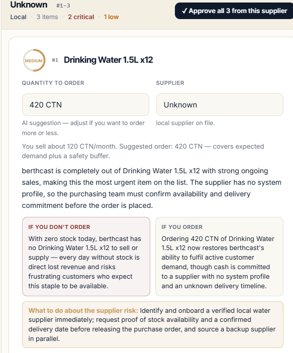

# berthcast

[](https://github.com/brother-yong/berthcast/actions/workflows/tests.yml)

AI inventory analysis for mid-market food distributors. Upload your inventory,
sales, supplier and purchase-order exports, and berthcast reads the messy
real-world spreadsheets, classifies every item, and produces consequence-aware
reorder recommendations — what to buy, how much, and what happens if you don't.

| At a glance | |
|---|---|
| **Status** | Live in production at [berthcast.com](https://berthcast.com) |
| **Pilot** | In use by a regional food distributor, on their real operations data |
| **Scale** | 1,300+ SKU catalogues; sales histories hundreds of thousands of rows deep |
| **Testing** | 46 standalone test files, run in CI on every push |
| **Built by** | One person, end to end — product, code, design, and operations |

| Every SKU classified, with the reasoning attached | Recommendations with the stakes spelled out |
|---|---|
|  |  |

---

## What it does

Distributors live in spreadsheets that never line up: different column names,
free-text annotations, mixed units, summary rows, multiple sheets. berthcast
turns those into decisions:

- **Ingests** raw `.xlsx` / `.csv` exports and normalises them — detecting the
  header row, the real stock column, units, and date formats — without the user
  mapping anything by hand.
- **Classifies** every item (`CRITICAL` / `LOW` / `HEALTHY` / `DEAD`) from
  velocity, stock on hand, and supplier lead time.
- **Recommends** reorders with the stakes attached: the revenue at risk, the
  lead-time pressure, spoilage risk for chilled/frozen lines, and orders already
  in transit.
- **Explains** each call in plain language, and lets staff approve or dismiss
  recommendations, track whether warnings came true, and print/export purchase
  sheets.

## How it works

The analysis is a small pipeline of focused agents, coordinated by an
orchestrator that owns the sequence and reports progress to the UI:

```
upload ──▶ normalization ──▶ inventory ──▶ recommendation ──▶ results
            (clean & map)     (classify)    (decide + stakes)
```

- **`agents/normalization.py`** — makes a messy sheet machine-readable.
- **`agents/inventory.py`** — classifies stock health per item.
- **`agents/recommendation.py`** — turns classification into actions with
  consequences.
- **`agents/verifier.py`** — deterministic safety net: recomputes the
  classification rules in pure Python and corrects provable slips in the AI's
  output before anything reaches the user.
- **`agents/orchestrator.py`** — runs them in order, stays free of any Flask /
  DB / email concerns, and talks to the outside world through two callbacks.

Each uploaded dataset lands in its own per-session SQLite tables
(`inventory_<id>`, `sales_<id>`, …) so analyses never bleed into each other.

## Engineering highlights

The interesting problems here aren't the AI calls — they're everything around
them:

| The hard part | How berthcast handles it |
|---|---|
| Real exports are messy — drifting item names, summary rows, mixed date formats, stray annotations | Header-row detection, drift-tolerant name matching, total-row filtering, multi-format date parsing. No manual column mapping. |
| AI output can't be blindly trusted with purchase decisions | Claude does the judgment, Python does the math. A deterministic verifier recomputes every classification rule from the same numbers the model saw and corrects provable slips. |
| Bad data in means bad advice out | A quality gate scores every upload (OK / WARN / BLOCK) before analysis, and the report states exactly which data gaps make which numbers uncertain — counted, not hand-waved. |
| Multiple companies' data on one box | Org-ownership checks on every data route, per-session tables, parameterised SQL, identifier whitelisting. |
| It has to stay up unattended | Daily backups with disk-space guards, a self-recovering health check, stuck-analysis recovery, per-org API caps, operator alerting on silent failures. |

## Tech stack

| Layer | Choice | Why |
|---|---|---|
| Backend | Python 3.11 · Flask · Gunicorn | Boring, stable, easy to reason about |
| AI | Anthropic Claude API | Used for judgment only — all arithmetic is done (and re-checked) in Python |
| Data | SQLite, raw SQL — no ORM | Single-box app; per-session tables keep tenants apart with zero ops overhead |
| Frontend | Server-rendered Jinja + vanilla JS | No build step, no framework churn |
| Hosting | Render, fronted by Cloudflare | Persistent disk, auto-deploy from `main` |

## Security posture

Multi-tenant app handling real business data, so the boring parts are taken
seriously:

- **Org isolation** — every per-session table access is checked against the
  requesting org before it runs.
- **SQL identifier whitelisting** — table/column names that must be spliced into
  SQL pass through a single sanitiser that allows only `[a-z0-9_]`; all values
  are parameterised.
- **Auth** — passwords hashed with `werkzeug`, tokens hashed at rest,
  CSRF protection on every form, `SECRET_KEY` required from the environment.
- **Login throttling** — in-memory per-IP rate limiting on auth endpoints.
- **Upload limits** — size, type, and structure are validated before parsing.

## Running locally

```bash
pip install -r requirements.txt
export ANTHROPIC_API_KEY=sk-ant-...      # your key
export SECRET_KEY=$(python -c "import secrets; print(secrets.token_hex(32))")
python app.py                            # dev server on http://localhost:5000
```

Sample (synthetic) data lives in [`fixtures/`](fixtures/) — generate fresh dummy
sheets with `python fixtures/generate_dummy_data.py`.

## Tests

46 standalone test files covering ingestion, classification, recommendation
logic, the deterministic verifier, auth, multi-tenant isolation, rate limiting,
and output escaping — plus a synthetic end-to-end fixture that drives the whole
pipeline offline. CI runs the suite on every push.

```bash
python run_tests.py
```

## Project layout

```
app.py                 Flask app — routes, auth, web/DB/email glue
agents/                the analysis pipeline (normalization → inventory → recommendation → verifier)
database.py            SQLite access + per-session table handling
auth_utils.py          org-ownership checks
validators.py          input validation
rate_limit.py          per-IP login throttle
templates/             Jinja templates
static/                CSS, icons, vendored JS
fixtures/              synthetic sample data + generator
tests/                 test suite + ingestion corpus
```

## License

Source-available for reference. All rights reserved — not licensed for reuse or
redistribution.
